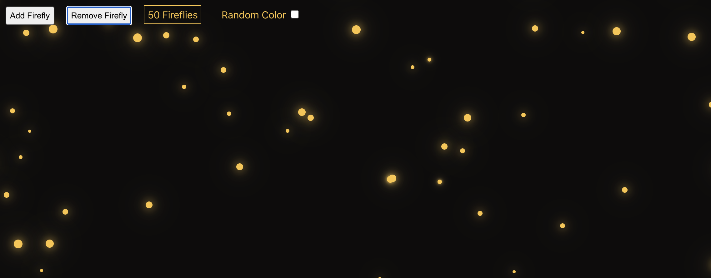
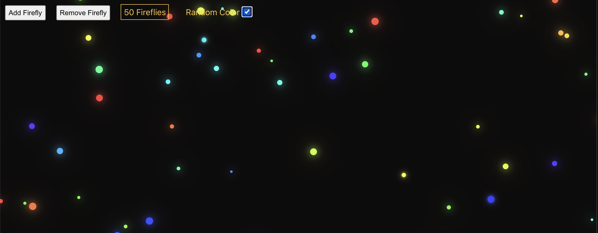

# Fireflies

## Table Contents  
* [Overview](#overview)
* [Getting Started](#getting-started)
* [Technologies Used](#technologies-used)
* [Controls](#controls)  
  * [Add Firefly Button](#add-firefly-button)
  * [Remove Firefly Button](#remove-firefly-button)
  * [Random Color](#random-color)
* [Development](#development)  
  * [Future Additions](#future-additions)
---
---

## Overview  

*Fireflies* is a small app that I decided to make in order to practice my newly acquired knowledge of React. It was made solely by me, John Teckemeyer, over one weekend. It is a fairly simple app that displays "fireflies" in a dark environment, which could be considered a modifiable screensaver, at most.

---
---
## Getting Started  
Check out 
[Fireflies here](https://TheTeck.github.io/Fireflies/)

##### No setup necessary! Upon starting the app, you will be presented with one lonely firefly. Adjust color and number of fireflies to your liking.

---
---

## Technologies Used

HTML, CSS, Javascript and React

---
---

## Controls

  

---

### *Add Firefly Button*:
The app starts with one lonely firefly. You can keep adding as many fireflies as you like! One click of the 'Add Firefly' button will add another firefly of random size and location. The color will also be random, if 'Random Color' is checked.

---
### *Remove Firefly Button*:
Maybe there are too many fireflies for your taste? No problem! Just click this button and the firefly population will decrease by one. 

---
### *Random Color*: 
If a single color is too boring for you, you can toggle between the standard yellow firefly color and a random color for each firefly. Just click the checkbox and the colors of all the fireflies are instantly changed to a more festive hue.

---
---
## Development 

### *Future Additions*:  
* Add ability to select specific colors
* Add objects that will reflect and refract the light from the fireflies
* Add different modes of movement (rain, swirling, etc.)